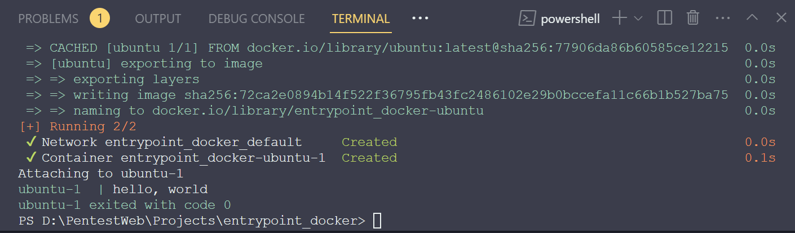
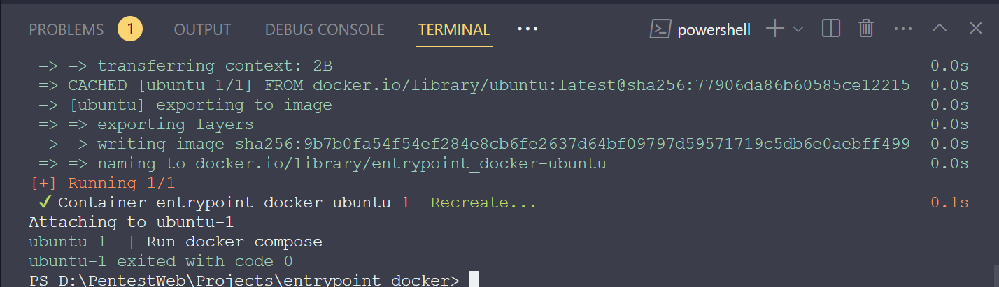

# What docker container actually do?
Docker containers are not meant to host an operating system. Container run task or process, such as to host an instance of web server, application server or database server.

Once task is completed, the container are exits. Container only lives as long as the process in process ID alive. If the process inside the container completed, stopped, crashes -> the container exits.

CMD and ENTRYPOINT are two Dockerfile instructions that together define the command that runs when your container starts. You must use these instructions in your Dockerfiles so that users can easily interact with your images.

# CMD vs ENTRYPOINT

## CMD
You can specify CMD instructions using shell or exec forms:

```dockerfile
CMD ["executable","param1","param2"] (exec form)
CMD ["param1","param2"] (exec form, as default parameters to ENTRYPOINT)
CMD command param1 param2 (shell form)
```

There can only be one CMD instruction in a Dockerfile. If you list more than one CMD, only the last one takes effect.

## ENTRYPOINT
An ENTRYPOINT allows you to configure a container that will run as an executable.

ENTRYPOINT has two possible forms:

The exec form, which is the preferred form:
```dockerfile
ENTRYPOINT ["executable", "param1", "param2"]
```
The shell form:
```dockerfile
ENTRYPOINT command param1 param2
```
## Different CMD & ENTRYPOINT
The difference between CMD and ENTRYPOINT in Docker's Dockerfile is as follows:

CMD (Command):

CMD is used to set the default command that will be run when initializing a container from an image.
If no CMD is defined, then when the container is initialized, it will run and exit immediately after finishing running.
CMD can be overridden by passing commands or parameters when launching the container.
CMD is commonly used to run applications or startup scripts in containers.
For example: CMD ["npm", "run", "dev"]

ENTRYPOINT:

ENTRYPOINT is used to define the command that the container will run on startup.
Unlike CMD, ENTRYPOINT cannot be completely overridden by commands or parameters when launching the container. Instead, the parameters will be passed as arguments to the ENTRYPOINT command.
ENTRYPOINT is typically used to run a single application within a container and allow parameters to be passed into that application.
For example: ENTRYPOINT ["npm", "start"]

When using both CMD and ENTRYPOINT in the same Dockerfile, the parameters passed when launching the container will be treated as arguments to the ENTRYPOINT command, while CMD will provide default arguments if no arguments are passed.

# So what if we use Entrypoint Dockerfile with docker-compose command???
docker-compose.yml
```yml
version: '3.8'

services:
  ubuntu:
    build: .
    command: "hello, world"
```
Dockerfile
```Dockerfile
FROM ubuntu

ENTRYPOINT [ "echo" ]
```
Result is 

# So what if we use CMD Dockerfile with docker-compose command???
docker-compose.yml
```yml
version: '3.8'

services:
  ubuntu:
    build: .
    command: "echo 'Run docker-compose'"
```
Dockerfile
```Dockerfile
FROM ubuntu

CMD echo "Run Dockerfile"
```

# So what if we use CMD Dockerfile with docker-compose Entrypoint
Result is 

REFERENCE: 
https://docs.docker.com/reference/dockerfile/#entrypoint
https://docs.docker.com/compose/compose-file/compose-file-v3