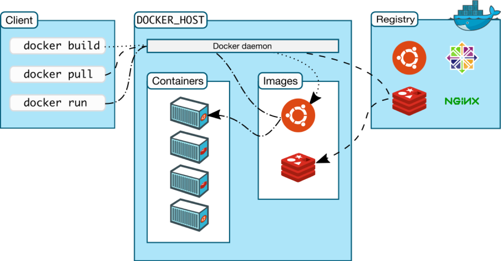

# Docker

## Introduction

Docker is an open-source platform that enables developers to build, deploy, and run applications using containers. Containers are lightweight, standalone, executable packages that include everything needed to run an application, including the code, runtime, system libraries, and system settings.

## Containers: The Foundation of Docker

Containers are a form of virtualization, similar to virtual machines (VMs), but with a few key differences. Unlike VMs, which virtualize the entire hardware stack, containers virtualize only the operating system (OS) kernel and share the host machine's resources. This makes containers more lightweight, efficient, and portable than VMs.

Containers are isolated from each other and from the host system, providing a secure and consistent environment for running applications. This isolation ensures that changes made within a container do not affect other containers or the host system, and vice versa.

## Docker Architecture

Docker follows a client-server architecture, with the following main components:

1. **Docker Client**: The Docker client is the primary interface for interacting with Docker. It communicates with the Docker daemon, which manages the containers.

2. **Docker Daemon**: The Docker daemon is a long-running process that manages containers, images, networks, and volumes. It listens for requests from the Docker client and manages the container lifecycle.

3. **Docker Images**: Docker images are read-only templates that contain instructions for creating Docker containers. They are constructed from a series of layers, each layer representing a set of changes applied to the base image.

4. **Docker Containers**: Containers are running instances of Docker images. They provide an isolated environment for running applications, with their own file system, networking, and resource constraints.

5. **Docker Registry**: A Docker registry is a central repository for storing and distributing Docker images. Docker Hub is the default public registry, but organizations can also set up private registries for their own images.



## Docker Workflow

The typical workflow when working with Docker involves the following steps:

1. **Create or pull a Docker image**: Developers can either create a new Docker image by writing a Dockerfile (a text file containing instructions for building the image), or they can pull an existing image from a registry like Docker Hub.

2. **Run a container from the image**: Once an image is available, developers can create and run one or more containers based on that image.

3. **Manage and interact with running containers**: Developers can start, stop, restart, inspect, and remove containers as needed. They can also connect to containers, execute commands within them, and attach storage volumes to persist data.

4. **Push or distribute images**: After making changes to an application or its dependencies, developers can create a new image and push it to a registry for distribution and deployment.

## Docker Benefits

Docker offers several benefits for developers and organizations:

1. **Portability**: Docker containers can run consistently across different environments (e.g., development, staging, production) and across different operating systems and cloud providers, eliminating the "works on my machine" problem.

2. **Efficiency**: Containers are lightweight and share the host machine's resources, making them more efficient than traditional virtual machines.

3. **Isolation**: Containers isolate applications and their dependencies, preventing conflicts and ensuring consistent behavior across different environments.

4. **Scalability**: Docker containers can be easily scaled up or down, allowing for efficient resource utilization and rapid deployment of applications.

5. **Continuous Integration and Deployment (CI/CD)**: Docker integrates well with CI/CD pipelines, enabling automated build, test, and deployment processes.

6. **Microservices Architecture**: Docker's lightweight and modular nature makes it well-suited for building and deploying microservices-based applications.

## Docker Use Cases

Docker is widely used in various scenarios, including:

1. **Application Development**: Docker simplifies the development and testing of applications by providing consistent and isolated environments.

2. **Continuous Integration and Deployment (CI/CD)**: Docker enables automated build, testing, and deployment processes, facilitating continuous integration and continuous deployment workflows.

3. **Microservices Architecture**: Docker containers are an ideal way to package and deploy individual microservices, enabling scalability and flexibility in large-scale applications.

4. **Cloud and Multi-cloud Deployments**: Docker containers can run consistently across different cloud providers, simplifying multi-cloud or hybrid cloud deployments.

5. **Application Modernization**: Docker can help organizations modernize legacy applications by containerizing them, enabling portability and reducing dependencies on specific infrastructure.

6. **Edge Computing and Internet of Things (IoT)**: Docker containers can be deployed on edge devices and IoT gateways, enabling edge computing scenarios.

## Docker Ecosystem and Tools

Docker has a rich ecosystem of tools and technologies that complement and extend its functionality:

1. **Docker Compose**: Docker Compose is a tool for defining and running multi-container Docker applications. It allows developers to specify and manage the services, networks, and volumes required by an application in a single configuration file.

2. **Docker Swarm**: Docker Swarm is a native clustering and orchestration solution for Docker containers. It enables the deployment and management of multi-container applications across multiple Docker hosts, providing features like load balancing, service discovery, and failover.

3. **Kubernetes**: Kubernetes is an open-source container orchestration platform that can be used to manage and automate the deployment, scaling, and management of containerized applications, including Docker containers.

4. **Docker Desktop**: Docker Desktop is a user-friendly application that provides an easy way to set up and manage Docker on local development machines.

5. **Docker Hub**: Docker Hub is the default public registry for Docker images. It provides a centralized repository for storing, sharing, and discovering Docker images.

6. **Docker Monitoring and Logging Tools**: Various third-party tools, such as Prometheus, Grafana, and the Elastic Stack (Elasticsearch, Logstash, Kibana), can be used to monitor and analyze Docker containers and their logs.

## Installation

1. **Install Docker**: Visit the official Docker website (https://www.docker.com/get-started) and follow the instructions to download and install Docker for your operating system.

2. **Verify Installation**: After installing Docker, open a terminal or command prompt and run the following command to verify that Docker is installed correctly:

```sh
docker --version
```

This should display the version of Docker installed on your system.

## Docker Images

Docker images are read-only templates that contain instructions for creating Docker containers. You can either use pre-built images from Docker Hub (Docker's public image registry) or create your own custom images.

1. **Pull an Image**: To pull an image from Docker Hub, run the following command:

```sh
docker pull <image_name>
```

Replace `<image_name>` with the name of the image you want to pull (e.g., `docker pull nginx` to pull the Nginx web server image).

2. **List Images**: To list all the images on your local machine, run:

```sh
docker images
```

3. **Create a Custom Image**: To create a custom image, you need to create a `Dockerfile` with instructions on how to build the image. Here's a simple example:

```dockerfile
# Use the official Node.js image as the base image
FROM node:latest

# Set the working directory
WORKDIR /app

# Copy the application files
COPY . .

# Install dependencies
RUN npm install

# Expose the port the app runs on
EXPOSE 3000

# Start the application
CMD ["npm", "start"]
```

run the following command to build the image:

```sh
docker build -t <image_name> .
```

Containers are running instances of Docker images.

Run a Container: To run a container from an image, use the following command:

```sh
docker run <image_name>
```

Run a Container in Detached Mode: To run a container in the background (detached mode), add the -d flag:

```sh
docker run -d <image_name>
```

List Running Containers
```sh
docker ps
```
Stop a Container
```sh
docker stop <container_id>
```
Remove a Container
```sh
docker rm <container_id>
```