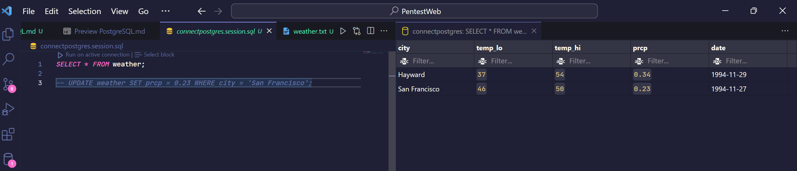
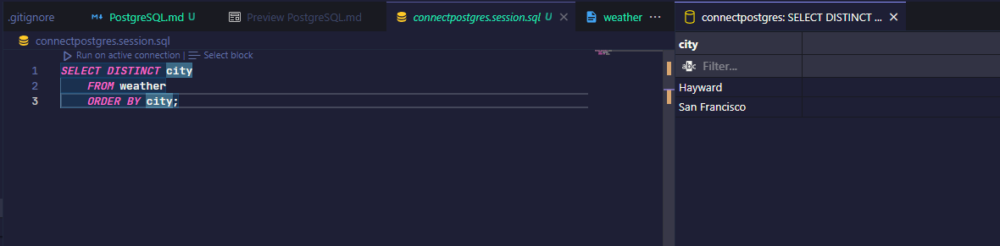

# PostgreSQL

## What is PostgreSQL ?
PostgreSQL is Object - Relational Management System (ORDBMS) based on POSTGRES, Version 4.2, developed at the University of California at Berkeley Computer Science Department.
### Postgres
Traditional relational database management systems (DBMSs) support a data model consisting of a collection of named relations, containing attributes of a specific type. In current commercial systems, possible types include floating point numbers, integers, character strings, money, and dates.
PostgreSQL is an open-source descendant of this original Berkeley code. It supports a large part of the SQL standard and offers many modern features.

### How to install PostgreSQL?
Click this link https://www.postgresql.org/download

### Architectural
#### PostgreSQL uses a client/server model
- **A server** responsible for manages database files, listening connection from client application to tranfer data and performs database actions. The database server program is called **postgres**.
- **The user's client** (frontend) application that wants to perform database operations by using cli, a graphical application, a web server access database to load web pages.

#### Logic PostgreSQL
- Database Cluster a list of database in a server
- Database
- Schema
- Object -> (Table, Index, Trigger)
- Database objects managed by OID

#### Physical PostgreSQL
- Database Cluster has a path call Base directory to store important files and folders. Each tables and indexs have their specific OID.


### Creating a Database
To create a new database, in this example named mydb, you use the following command:
```sh
createdb mydb
```
It can be activated for the mydb database by typing the command:
```sh
$ psql mydb
```
Now let check version of PostgreSQL
```postgresql
mydb=> SELECT version();
                          version
------------------------------------------------------------
 PostgreSQL 16.2, compiled by Visual C++ build 1937, 64-bit
(1 row)


mydb=#
```
For example, you can get help on the syntax of various PostgreSQL SQL commands by typing:
```postgresql
mydb=> \h
```
To quit use
```postgresql
mydb=> \q
```

### Creating a New Table
Create __relations__ or tables to store data
```postgresql
CREATE TABLE weather (
    city            varchar(80),
    temp_lo         int,           -- low temperature
    temp_hi         int,           -- high temperature
    prcp            real,          -- precipitation
    date            date
);

CREATE TABLE cities (
    name            varchar(80),
    location        point
);
```

### Insert a Table with Rows
```postgresql
INSERT INTO weather VALUES ('San Francisco', 46, 50, 0.25, '1994-11-27');
```
```postgresql
INSERT INTO cities VALUES ('San Francisco', '(-194.0, 53.0)');
```
### Querying a Table
To get data from a table we use SELECT statement and select list then FROM table list.

```postgresql
SELECT * FROM weather;
```


```postgresql
SELECT city, temp_lo, temp_hi, prcp, date FROM weather;
```
You can write expressions, not just simple column references, in the select list. For example, you can do:
```postgresql
SELECT city, (temp_hi+temp_lo)/2 AS temp_avg, date FROM weather;
```
You can request that duplicate rows be removed from the result of a query:
```postgresql
SELECT DISTINCT city FROM weather
```


We can also join a table against itself. This is called a self join. As an example, suppose we wish to find all the weather records that are in the temperature range of other weather records. So we need to compare the temp_lo and temp_hi columns of each weather row to the temp_lo and temp_hi columns of all other weather rows. We can do this with the following query:

```postgresql
SELECT w1.city, w1.temp_lo AS low, w1.temp_hi AS high,
       w2.city, w2.temp_lo AS low, w2.temp_hi AS high
    FROM weather w1 JOIN weather w2
        ON w1.temp_lo < w2.temp_lo AND w1.temp_hi > w2.temp_hi;
```

### Aggregate Functions
count, sum, avg (average), max (maximum) and min (minimum),...
```postgresql
SELECT max(temp_lo) FROM weather;
```

#### Example
If you want to find lowest temperature of a city
```postgresql
SELECT city FROM weather
    WHERE temp_lo = (SELECT max(temp_lo) FROM weather);
```

```postgresql
SELECT COUNT(customer_id), country
FROM customers
GROUP BY country;
```

### Updates
Update existing rows with UPDATE statement
```postgresql
UPDATE weather
    SET temp_hi = temp_hi - 2,  temp_lo = temp_lo - 2
    WHERE date > '1994-11-28';
```

### Delete
```postgresql
DELETE FROM weather WHERE city = 'Hayward';
```

### Advance Functions

#### Window Functions
A window function performs a calculation across a set of table rows that are somehow related to the current row. This is comparable to the type of calculation that can be done with an aggregate function. However, window functions do not cause rows to become grouped into a single output row like non-window aggregate calls would. Instead, the rows retain their separate identities. Behind the scenes, the window function is able to access more than just the current row of the query result.

```postgresql
SELECT depname, empno, salary, avg(salary) OVER (PARTITION BY depname) FROM empsalary;
```

```
 depname  | empno | salary |          avg
-----------+-------+--------+-----------------------
 develop   |    11 |   5200 | 5020.0000000000000000
 develop   |     7 |   4200 | 5020.0000000000000000
 develop   |     9 |   4500 | 5020.0000000000000000
 develop   |     8 |   6000 | 5020.0000000000000000
 develop   |    10 |   5200 | 5020.0000000000000000
 personnel |     5 |   3500 | 3700.0000000000000000
 personnel |     2 |   3900 | 3700.0000000000000000
 sales     |     3 |   4800 | 4866.6666666666666667
 sales     |     1 |   5000 | 4866.6666666666666667
 sales     |     4 |   4800 | 4866.6666666666666667
```

