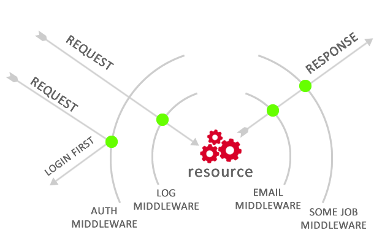

# What is Middleware?
**Middleware** are intermediate pieces of code between requests and responses. It receives requests and executes corresponding commands on that request. Once completed, it responds or passes the delegated results to another Middleware in the request - response circle.

## Why we need to use middleware in web services?
Using middleware helps us minimize the amount of code lines we have to write and has high reusability. A example for important of middleware is auth middleware that user must authenticate with middleware before direct to admin page. We need something to interact with req/res so Middleware are used to preprocess and filter requests before processing them logically or adjusting responses before sending them to the user.

## ExpressJS has a lot of middlewares 
- Application-level middleware
- Router-level middleware
- Error-handling middleware
- Built-in middleware
- Third-party middleware

**body-parser**: This middleware is used to parse and extract the content of HTTP requests (e.g., form data, JSON) and place it into the req.body property.

```javascript
const express = require('express');
const bodyParser = require('body-parser');

const app = express();
app.use(bodyParser.json());
app.use(bodyParser.urlencoded({ extended: true }));

// Your routes and other middleware
const app = express();
app.use(bodyParser.json());
app.use(bodyParser.urlencoded({ extended: true }));
```

**express-session**: This middleware creates a session for each request, allowing you to store user session state data.

```javascript
const express = require('express');
const session = require('express-session');

const app = express();
app.use(session({
  secret: 'your_secret_key',
  resave: false,
  saveUninitialized: true
}));
```

**cors**: This middleware is used to handle Cross-Origin Resource Sharing (CORS) in Express, allowing or denying requests from different sources.

```javascript
const express = require('express');
const cors = require('cors');

const app = express();
app.use(cors());
```
**morgan**: This middleware is used to log HTTP requests, aiding in monitoring and debugging of the application.

```javascript
const express = require('express');
const morgan = require('morgan');

const app = express();
app.use(morgan('dev'));
```
**passport**: This middleware provides authentication strategies to verify user identity, including basic authentication, OAuth authentication, and more.

```javascript
const express = require('express');
const passport = require('passport');

const app = express();
app.use(passport.initialize());
app.use(passport.session());
```

**compression**: This middleware is used to compress HTTP responses before sending them to the client, improving performance and reducing bandwidth.

```javascript
const express = require('express');
const compression = require('compression');

const app = express();
app.use(compression());
```

**cookie-parser**: The following example illustrates installing and loading the cookie-parsing middleware

```javascript
const express = require('express')
const app = express()
const cookieParser = require('cookie-parser')

// load the cookie-parsing middleware
app.use(cookieParser())
```