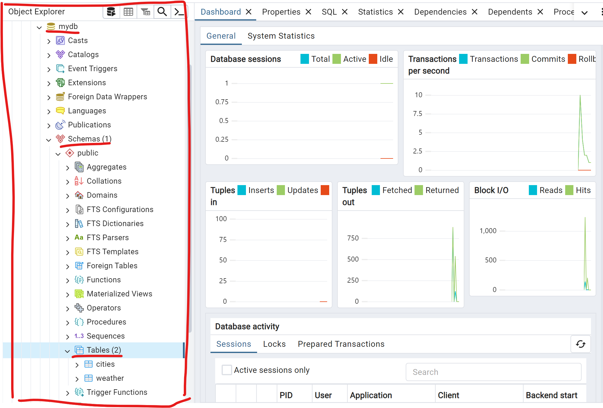

# PostgreSQL

## What is PostgreSQL ?
PostgreSQL is Object - Relational Management System (ORDBMS) based on POSTGRES, Version 4.2, developed at the University of California at Berkeley Computer Science Department. PostgreSQL is designed to run on UNIX-like platforms. However, PostgreSQL was later dynamically adapted to run on many different platforms such as Mac OS X, Solaris and Windows. PostgreSQL is a free open source.

## How to install PostgreSQL?
Click this link https://www.postgresql.org/download

## Architectural
### PostgreSQL uses a client/server model
- **A server** responsible for manages database files, listening connection from client application to tranfer data and performs database actions. The database server program is called **postgres**.
- **The user's client** (frontend) application that wants to perform database operations by using cli, a graphical application, a web server access database to load web pages.

### Architectural Logic PostgreSQL
- Database Cluster: list of database in a server
- Database: database
- Schema: A datatabase schema is the "blueprint" or "constructor" of a database which describes how the data may relate to other tables or other data models
- Objects -> (Tables, Indexs, Triggers)
- Database objects managed by OID



### Architectural Physical PostgreSQL
- Database Cluster has a path call Base directory to store important files and folders. 
- In PostgreSQL/../data path will contain many important files, sub
- Each tables and indexs have their specific OID.


### Important files
**Connection config files**: Config which IPs, protocols, methods, user/passwd, no passwd
- pg_hba.conf: host-based authentication - used to config which hosts can connect with your database
- pg_ident.conf: mapping files - In case, the external application connects instead using user/passwd

**Information files**: Files contain information of our sql application, databases,...
- PG_VERSION: Contains version of database.
- current_logfiles: Infomation of files log.
- Postmaster infomation: all infomation of postmaster saved on postmaster.opts, postmaster.pid 

**Database configuration files**: Store all arguments to configure database.
- postgresql.conf: Store many data about db system: resource usage, locations, connections and authentications, logs,...
- postgresql.auto.conf: Infomation of configuration parameters after used `ALTER SYSTEM` saved on there. Value of this file will append data on postgresql.conf. 

### Important folders
- base: store object database
- global: global object database
- log: logging activities of interactive with PostgresSQL DB.
- pg_wal: logging the change on database.

### Tablespace
- Tablespaces in PostgreSQL allow database administrators to define locations in the file system where the files representing database objects can be stored. Once created, a tablespace can be referred to by name when creating database objects.

- By using tablespaces, an administrator can control the disk layout of a PostgreSQL installation. This is useful in at least two ways. First, if the partition or volume on which the cluster was initialized runs out of space and cannot be extended, a tablespace can be created on a different partition and used until the system can be reconfigured.

### Creating a Database
To create a new database, in this example named mydb, you use the following command:
```sh
createdb mydb
```
It can be activated for the mydb database by typing the command:
```sh
$ psql mydb
```
Now let check version of PostgreSQL
```postgresql
mydb=> SELECT version();
                          version
------------------------------------------------------------
 PostgreSQL 16.2, compiled by Visual C++ build 1937, 64-bit
(1 row)


mydb=#
```
For example, you can get help on the syntax of various PostgreSQL SQL commands by typing:
```postgresql
mydb=> \h
```
To quit use
```postgresql
mydb=> \q
```

### Creating a New Table
Create __relations__ or tables to store data
```postgresql
CREATE TABLE weather (
    city            varchar(80),
    temp_lo         int,           -- low temperature
    temp_hi         int,           -- high temperature
    prcp            real,          -- precipitation
    date            date
);

CREATE TABLE cities (
    name            varchar(80),
    location        point
);
```

### Insert a Table with Rows
```postgresql
INSERT INTO weather VALUES ('San Francisco', 46, 50, 0.25, '1994-11-27');
```
```postgresql
INSERT INTO cities VALUES ('San Francisco', '(-194.0, 53.0)');
```
### Querying a Table
To get data from a table we use SELECT statement and select list then FROM table list.

```postgresql
SELECT * FROM weather;
```


```postgresql
SELECT city, temp_lo, temp_hi, prcp, date FROM weather;
```
You can write expressions, not just simple column references, in the select list. For example, you can do:
```postgresql
SELECT city, (temp_hi+temp_lo)/2 AS temp_avg, date FROM weather;
```
You can request that duplicate rows be removed from the result of a query:
```postgresql
SELECT DISTINCT city FROM weather
```


We can also join a table against itself. This is called a self join. As an example, suppose we wish to find all the weather records that are in the temperature range of other weather records. So we need to compare the temp_lo and temp_hi columns of each weather row to the temp_lo and temp_hi columns of all other weather rows. We can do this with the following query:

```postgresql
SELECT w1.city, w1.temp_lo AS low, w1.temp_hi AS high,
       w2.city, w2.temp_lo AS low, w2.temp_hi AS high
    FROM weather w1 JOIN weather w2
        ON w1.temp_lo < w2.temp_lo AND w1.temp_hi > w2.temp_hi;
```

### Indexing
Index is a data structure reduces query time of SQL commands (SELECT, WHERE, ORDER, GROUP). But the disadvantage of index is slow down time input data to objects because processing of index must add records to indexing table.
```postgresql
CREATE INDEX weather_index ON weather (cities);
```
### Aggregate Functions
count, sum, avg (average), max (maximum) and min (minimum),...
```postgresql
SELECT max(temp_lo) FROM weather;
```

#### Example
If you want to find lowest temperature of a city
```postgresql
SELECT city FROM weather
    WHERE temp_lo = (SELECT max(temp_lo) FROM weather);
```

```postgresql
SELECT COUNT(customer_id), country
FROM customers
GROUP BY country;
```

### Updates
Update existing rows with UPDATE statement
```postgresql
UPDATE weather
    SET temp_hi = temp_hi - 2,  temp_lo = temp_lo - 2
    WHERE date > '1994-11-28';
```

### Delete
```postgresql
DELETE FROM weather WHERE city = 'Hayward';
```

