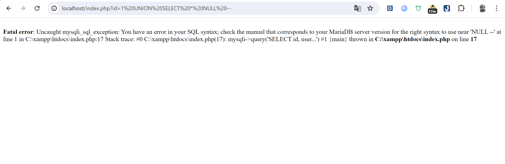

# Dạng lỗi SQL dễ khai thác nhất và thường gặp nhất trong các dạng đề CTF - EASY -> In-band
## Error Base SQLi
Đây là dạng lỗi SQLi thường gặp nhất và được cho là dễ khai thác cũng như dễ nhận biết bởi vì các dev của chúng ta không xử lí lỗi của SQL query mà thay vào đó là để nó hiện ra mỗi khi attacker inject payload.

### Những dạng Error thường gặp

**MySQL:**

- `You have an error in your SQL syntax; check the manual that corresponds to your MySQL server version for the right syntax to use near '...'`
- `Warning: mysql_fetch_array() expects parameter 1 to be resource, boolean given in ...`

**PostgreSQL:**

- `ERROR: syntax error at or near "..." at character ...`
- `ERROR: unterminated quoted string at or near "..."`

**MSSQL:**

- `Unclosed quotation mark after the character string '...'`
- `Incorrect syntax near '...'`

#### Code minh họa
```php
<?php
$servername = "localhost";
$username = "root";
$password = "";
$dbname = "test_db";

$conn = new mysqli($servername, $username, $password, $dbname);

if ($conn->connect_error) {
    die("Connection failed: " . $conn->connect_error);
}

if ($_SERVER["REQUEST_METHOD"] == "POST") {
    $username = $_POST['username'];
    $password = $_POST['password'];

    $sql = "SELECT * FROM users WHERE username = '$username' AND password = '$password'";
    $result = $conn->query($sql);

    if ($result->num_rows > 0) {
        echo "Login successful!";
    } else {
        echo "Invalid username or password.";
    }
}
?>

<!DOCTYPE html>
<html>
<body>
<form method="post" action="">
    Username: <input type="text" name="username"><br>
    Password: <input type="password" name="password"><br>
    <input type="submit" value="Login">
</form>
</body>
</html>

```
**Khai thác**
Bằng cách inject một payload nào đó nhầm gây lỗi như `'`

**Kết quả trong truy vấn**
```sql
SELECT * FROM users WHERE username = ''' AND password = 'anything';
```
**Xuất hiện lỗi**
```sql
You have an error in your SQL syntax; check the manual that corresponds to your MySQL server version for the right syntax to use near '' AND password = 'anything'' at line 1

```
**Phòng tránh**
Sử dung bind_param() để gán giá trị nào các tham số cho sql query trách bị inject
```php
<?php
$conn = new mysqli($servername, $username, $password, $dbname);

if ($conn->connect_error) {
    die("Connection failed: " . $conn->connect_error);
}

if ($_SERVER["REQUEST_METHOD"] == "POST") {
    $username = $_POST['username'];
    $password = $_POST['password'];

    $stmt = $conn->prepare("SELECT * FROM users WHERE username = ? AND password = ?");
    $stmt->bind_param("ss", $username, $password);
    $stmt->execute();
    $result = $stmt->get_result();

    if ($result->num_rows > 0) {
        echo "Login successful!";
    } else {
        echo "Invalid username or password.";
    }

    $stmt->close();
}
$conn->close();
?>

```
## Union-Based SQLi
Union-Based dựa trên sức mạnh của câu lệnh `UNION` trong SQL. Ta có thể dùng câu lệnh `UNION` để lấy thêm thông tin từ các bảng khác mà ta truy vấn.

## Demo lỗ hổng

```php
<?php
$servername = "localhost";
$username = "root";
$password = "";
$dbname = "test_db";

$conn = new mysqli($servername, $username, $password, $dbname);

if ($conn->connect_error) {
    die("Connection failed: " . $conn->connect_error);
}

if (isset($_GET['id'])) {
    $id = $_GET['id'];
    $sql = "SELECT username, password FROM users WHERE id = $id";
    $result = $conn->query($sql);

    if ($result->num_rows > 0) {
        while($row = $result->fetch_assoc()) {
            echo "Username: " . $row["username"]. " - Password: " . $row["password"]. "<br>";
        }
    } else {
        echo "0 results";
    }
}
$conn->close();
?>

```
Audit đoạn mã trên ta thấy rằng đây là một đoạn code khá dễ bị tổn thương do biến $id có thể bị truyền dữ liệu trực tiếp vào.

## Khai thác

### Xác định lỗi
Thử inject vào các payload như `1 UNION SELECT NULL--` để xác định hệ thống có đang bị lỗi hay không.

### Khai thác lỗi
Khi xác định hệ thống đã dính lỗi SQLi thì ta bắt đầu inject thử các payload nhằm extract data.
```sql
1 UNION SELECT username, email FROM users--
```
## Cách phòng tránh
Sử dụng hàm `bind_param()` để handle user input vào câu lệnh query
```php
$stmt = $conn->prepare("SELECT username, password FROM users WHERE id = ?"); 
$stmt->bind_param("i", $id); $stmt->execute();
$result = $stmt->get_result();
while($row = $result->fetch_assoc()) {
  echo "Username: " . $row["username"]. " - Password: " . $row["password"]. "<br>";
}
```

