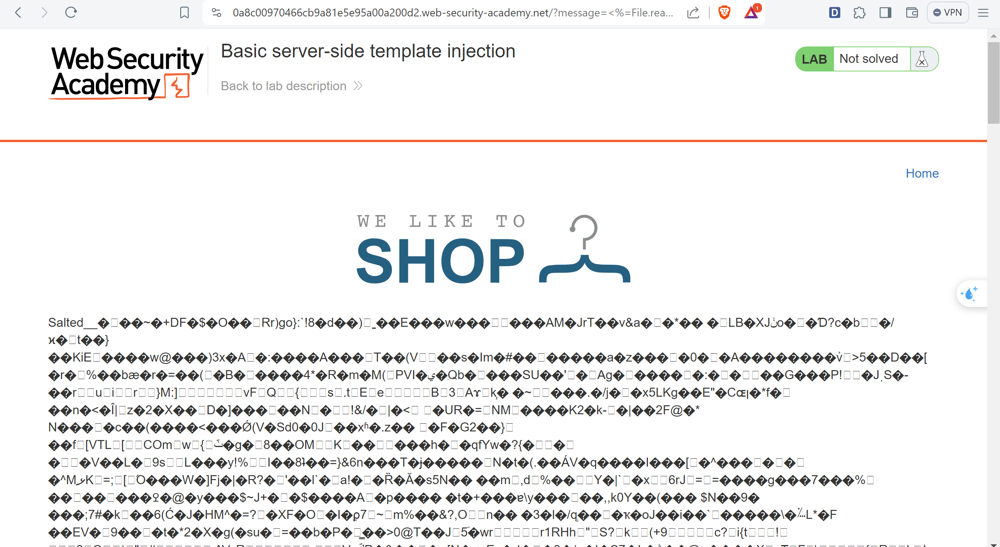

# SERVER-SIDE TEMPLATE INJECTION RESEARCH
## What is SSTI?
SSTI or Server-Site template injection is when a template engines allows user inject malicious payload into a template. 

## Where do it occur in the web?
Malicious code of attacker run on server allows attacker control of the server. Depending on template engines, some of them give attacker remote code execution & take full control of back-end server using it to perform attacks to another infrastructure.

Instead of render static value, template engine allows user input dynamically generated at template and response to user (some ssti vuln not respone to user bc it not render this value to render functions).

Example: Flask (Jinja2)

**server.py**
```python
from flask import render_template

@app.route('/hello/')
@app.route('/hello/<name>')
def hello(name=None):
    return render_template('hello.html', name=name)
```

**hello.html**
```html
<!doctype html>
<title>Hello from Flask</title>

  <h1>Hello {{ name }}!</h1>

  <h1>Hello, World!</h1>

```

## How many type?
No type. Each Programming languages has different template engine so their has severally technique to exploit.

## How to detect
### BlackBox
On the blackbox side, people often check for ssti vulnerabilities through payloads of the form sequence of special characters `${{<%[%'"}}%\`. Usually, webapps that allow debugging vulnerabilities on the frontend will respond with vulnerabilities that allow the attacker to know whether the website has that vulnerability or not.

### WhiteBox
In the whitebox, when auditing the source code, if you encounter code that allows users to directly enter input without preventing special characters, it will easily lead to ssti.


Example: Python Flask (Jinja2)
```python
from flask import Flask, request, render_template_string

app = Flask(__name__)

@app.route("/")
def home():
    if request.args.get('user'):
        return render_template_string(request.args.get('user'))
    else:
        return "/?user=... input something in ..."

if __name__ == "__main__":
    app.run()

```
The URL would be:
```
http://vulnerable-website.com/?user={{7*7}}
```
Result


Otherwise, we can manually to identify which template engine is used by inject template engine syntax. For example, the payload {{7*'7'}} returns 49 in Twig and 7777777 in Jinja2.


## How to exploit (Jinja2)
With each template engine, programming language, and web server, the attack methods are more diverse and different.
### Learn the basic template syntax ???????
Learn the basic syntax of template engine or programming language that help you understand how to write a good payload to exploit (don't be script kiddie).
```python
{{configs.items()}}
```

### Find some known exploit payload to test
```python
''.__class__.__mro__[1].__subclasses__()[238]('/etc/passwd').read() }}
```
''.__class__ : type of this current instance
''.__class__.__mro__[1] : Method resolution order(MRO) using in multiple inheritances by DLR or depth-first left to right algorithm. Purpose of this is to find out object class (something has many many subclasses and function to using like)
''.__class__.__mro__[1].__subclasses__()[238]: Maybe it call to FileIO. Compile code like FileIO('/etc/passwd').read()

## How to prevent
Another measure is to only execute users' code in a sandboxed environment where potentially dangerous modules and functions have been removed altogether. Unfortunately, sandboxing untrusted code is inherently difficult and prone to bypasses.

Finally, another complementary approach is to accept that arbitrary code execution is all but inevitable and apply your own sandboxing by deploying your template environment in a locked-down Docker container, for example.
(Still don't know how to prevent this! => Best practices???)

## LAB 1 PORTSWIGGER - Basic server-side template injection
Look at this URL of webapp `https://0a8100d203b22e1882795106002d00ab.web-security-academy.net/?message=` this message parameter would render data response to us any input we pass to it.

So what is template engine it used? ERB?

Try to input something `<%= name %>` name is unassign variable in this app.


Error give me lots of important information -> this webapp using ERB template.

Use 
```ruby
<%= File.read('morale.txt') %>
```

Requirement: delete the morale.txt file from Carlos's home directory.
```ruby
<%= File.delete('morale.txt') %>
```

Done

## LAB 2 PORTSWIGGER - Basic server-side template injection (code context)

Simple blogger webapp


After loggin with name `wiener:peter` we can edit user account.


Testing with some special characters email has no error or ssti.

But the Preferred name function is very suspicious
Intercept the request we got:

`blog-post-author-display=user.name` => this web using dynamic data pass through Tornado to render name of user. The idea that we need to exploit this vuln here by inject our payload like `}}{%%20import%20os%20%}{{os.system('rm%20/home/carlos/morale.txt')` that I was referred above.

